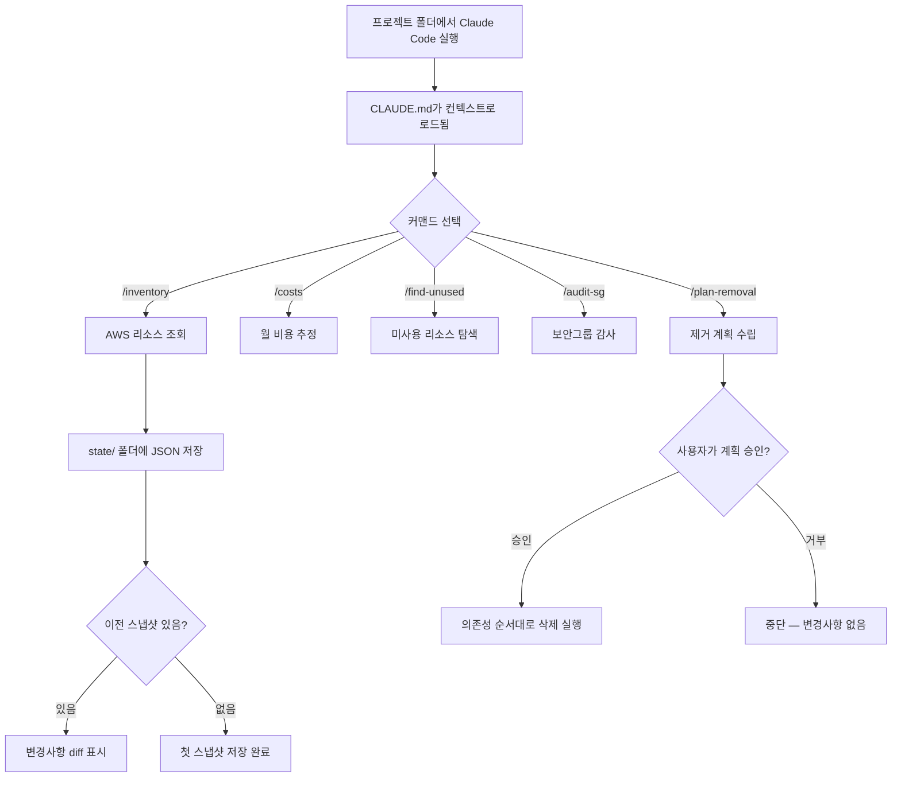
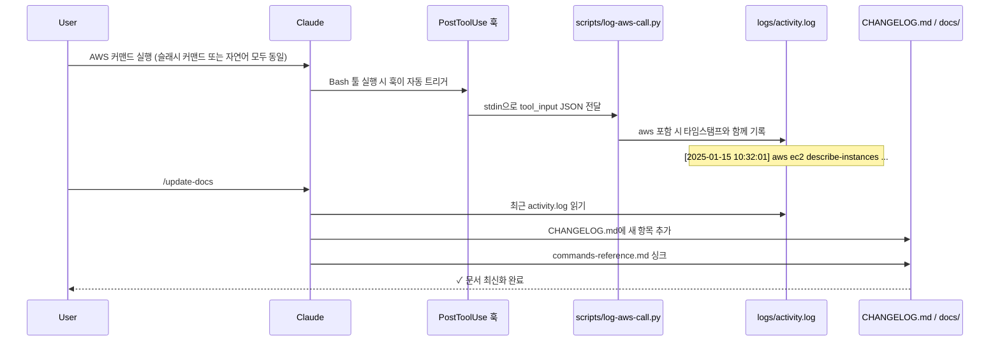

# infra-as-claude

> Claude Code로 AWS 인프라를 관리하는 Kit — 슬래시 커맨드, 자동 상태 스냅샷, 보안 감사, 비용 분석, 자동 업데이트 문서화까지.

이 Kit은 [Claude Code](https://claude.ai/code)를 구조화된 AWS 인프라 관리 도구로 만들어줍니다. **Claude 설정을 위한 IaC**라고 생각하면 됩니다. 버전 관리되는 커맨드, 권한 허용 목록, 자동 상태 추적, 그리고 스스로 업데이트되는 문서까지 모두 포함합니다.

---

## 어떻게 동작하나요?



### 문서 자동 업데이트 흐름



---

## 주요 기능

| 기능                    | 설명                                                                                 |
| ----------------------- | ------------------------------------------------------------------------------------ |
| **7개 슬래시 커맨드**   | `/inventory`, `/costs`, `/find-unused`, `/audit-sg`, `/plan-removal`, `/update-docs`, `/commit` |
| **상태 스냅샷**         | 리소스 상태를 JSON으로 저장, 실행할 때마다 이전과 diff 비교                          |
| **자동 활동 로그**      | `PostToolUse` 훅 → `scripts/log-aws-call.py`로 모든 AWS CLI 호출이 자동 기록됨       |
| **자동 문서 업데이트**  | `/update-docs`로 CHANGELOG와 레퍼런스 문서를 동기화                                  |
| **읽기 전용 자동 허용** | 조회 커맨드는 확인 없이 바로 실행                                                    |
| **보호 리소스 설정**    | 공유 리소스를 등록하면 Claude가 실수로 삭제하지 않음                                 |
| **원커맨드 셋업**       | `./setup.sh` 하나로 모든 설정 완료                                                   |

---

## 시작 전 준비사항

- **Claude Code** — [설치 가이드](https://docs.anthropic.com/claude-code)
- **AWS CLI v2** — [설치 가이드](https://aws.amazon.com/ko/cli/)
- **Python 3** — macOS에 기본 설치됨. `python3 --version`으로 확인
- 읽기 권한이 있는 **AWS 계정** (IAM 사용자 또는 역할)

---

## 빠른 시작

**Claude Code**만 설치되어 있으면 됩니다. Claude Code를 열고 아래 메시지를 그대로 붙여넣으세요:

```
https://github.com/Jiwook00/infra-as-claude 의 README를 읽고, 이 킷을 처음 설정하는 과정을 단계별로 안내해줘.
```

### 1단계 — 이 저장소를 Fork

페이지 상단의 **Fork** 버튼을 눌러 내 GitHub 계정에 복사본을 만드세요.

- 내 커스텀 설정을 버전 관리할 수 있습니다
- 이 upstream 저장소의 업데이트를 한 줄 명령으로 가져올 수 있습니다
- 새 커맨드를 만들어 PR로 기여할 수 있습니다

### 2단계 — Fork한 저장소 clone

```bash
git clone https://github.com/내_깃허브_아이디/infra-as-claude.git
cd infra-as-claude
```

### 3단계 — setup.sh 실행

```bash
./setup.sh
```

스크립트가 아래 항목들을 물어봅니다:

| 입력 항목           | 예시                    |
| ------------------- | ----------------------- |
| AWS 프로필 이름     | `mycompany`             |
| AWS 리전            | `eu-central-1`          |
| AWS 계정 ID         | `123456789012`          |
| 메인 도메인         | `example.com`           |
| VPC ID              | `vpc-0abc1234`          |
| AWS 자격증명 (선택) | Access Key + Secret Key |

실행 후 자동으로 생성되는 파일:

- `CLAUDE.md` — 내 환경에 맞는 컨텍스트 파일 (`CLAUDE.md.template`에서 생성)
- `.claude/settings.json` — 권한 허용 목록 (`.claude/settings.json.example`에서 생성)
- `state/`, `logs/` 폴더

### 4단계 — Claude Code 실행

```bash
claude
```

## 슬래시 커맨드

### `/inventory`

모든 AWS 리소스를 조회하고 `state/`에 JSON 스냅샷을 저장합니다. 이전 스냅샷이 있으면 변경된 내용을 diff로 보여줍니다.

```
/inventory
```

### `/costs`

현재 실행 중인 리소스의 월 비용을 온디맨드 가격 기준으로 추정합니다.

```
/costs
/costs api-service        ← 특정 서비스만 필터링
```

### `/find-unused`

비용이 낭비되고 있는 미사용 리소스를 찾아냅니다. 연결되지 않은 EBS, 고아 EIP, 빈 타겟그룹, 정지된 EC2 등을 탐색합니다.

```
/find-unused
```

### `/audit-sg`

VPC 내 모든 보안그룹을 감사합니다. 위험도(HIGH / MEDIUM / LOW / INFO)로 분류하여 결과를 보여줍니다.

```
/audit-sg
```

### `/plan-removal`

서비스 또는 리소스에 대해 의존성을 분석한 안전한 제거 계획을 수립합니다. 삭제할 것, 보존할 것, 사전 체크리스트를 포함합니다.

```
/plan-removal my-service
/plan-removal i-0abc1234
```

### `/update-docs`

`logs/activity.log`의 최근 활동을 바탕으로 `CHANGELOG.md`와 `docs/commands-reference.md`를 동기화합니다.

```
/update-docs
```

### `/commit`

현재 git 변경사항을 분석하고 Conventional Commits 형식의 한국어 커밋 메시지를 제안합니다. 변경사항을 그룹별로 분석해 단일 또는 분할 커밋을 안내합니다.

```
/commit
```

---

## 프로젝트 구조

```
infra-as-claude/
│
├── README.md                      # 이 파일
├── CHANGELOG.md                   # /update-docs가 자동으로 업데이트
├── CLAUDE.md.template             # 템플릿 — CLAUDE.md는 자동 생성됨
├── setup.sh                       # 최초 1회 설정 스크립트
├── .gitignore
│
├── .claude/
│   ├── settings.json.example      # 권한 허용 목록 템플릿
│   └── commands/
│       ├── inventory.md           # /inventory 커맨드
│       ├── costs.md               # /costs 커맨드
│       ├── find-unused.md         # /find-unused 커맨드
│       ├── audit-sg.md            # /audit-sg 커맨드
│       ├── plan-removal.md        # /plan-removal 커맨드
│       ├── update-docs.md         # /update-docs 커맨드
│       └── commit.md              # /commit 커맨드
│
├── scripts/
│   └── log-aws-call.py            # PostToolUse 훅 — AWS CLI 호출을 activity.log에 기록
│
├── docs/
│   ├── setup-guide.md             # 상세 설정 가이드
│   ├── commands-reference.md      # 전체 커맨드 레퍼런스 (자동 싱크됨)
│   └── patterns.md                # 권장 워크플로우 & 베스트 프랙티스
│
├── state/                         # AWS 리소스 스냅샷 (자동 생성)
│   ├── ec2.json
│   ├── alb.json
│   └── ...
│
├── logs/                          # 활동 로그 (자동 생성)
│   └── activity.log
│
└── examples/
    └── .env.example               # 환경변수 예시
```

**`setup.sh`가 생성하는 파일들 (gitignore 대상):**

- `CLAUDE.md` — 내 환경에 맞게 생성된 컨텍스트 파일
- `.claude/settings.json` — 실제 권한 설정
- `.env` — 환경변수
- `state/*.json` — AWS 스냅샷
- `logs/*.log` — 활동 로그

---

## 권한 모델

이 킷은 Claude Code의 권한 시스템을 사용합니다.

### 자동 허용 (확인 없이 즉시 실행)

`settings.json`에 미리 등록된 읽기 전용 AWS 커맨드들:

```
aws * describe-*    ← 모든 리소스 describe
aws * list-*        ← 모든 리소스 list
aws * get-*         ← 리소스 상세 조회
```

### 사용자 승인 필요

아래 쓰기 작업은 실행 전 반드시 확인을 요청합니다:

```
aws * create-*
aws * delete-*
aws * modify-*
aws * update-*
aws * terminate-*
```

인프라를 자유롭게 조회할 수 있지만, Claude가 아무것도 몰래 삭제하거나 변경하지 않습니다.

---

## 보호 리소스

`CLAUDE.md`의 **보호 리소스** 테이블에 등록된 리소스는 제거 계획에 포함될 경우 반드시 경고를 표시하고 명시적 확인을 받습니다.

보호 대상으로 등록하면 좋은 것들:

- 공유 VPC
- 여러 서비스가 함께 쓰는 ALB
- 공유 보안그룹
- 여러 인스턴스에서 사용하는 키 페어
- Route 53 호스팅 존, ACM 인증서

### 보호 리소스 자동 제안

보호 리소스를 직접 다 파악할 필요 없어요. Claude가 작업 중에 공유 인프라로 보이는 리소스를 발견하면 먼저 제안합니다.

```
"sg-0abc1234 (bastion-sg) 가 현재 7개 인스턴스에서 사용되고 있어요.
보호 리소스 목록에 추가할까요? [y/N]"
```

`y`라고 답하면 Claude가 `CLAUDE.md`의 보호 리소스 테이블을 직접 업데이트합니다. 이 방식으로 실제 작업을 하면서 자연스럽게 목록이 쌓여갑니다.

---

## 킷 업데이트 받기

Fork한 저장소에서 upstream 개선 사항을 가져오려면:

```bash
git remote add upstream https://github.com/danny-ys/infra-as-claude.git
git fetch upstream
git merge upstream/main
```

템플릿 파일이 변경된 경우 `./setup.sh`를 다시 실행하세요.

---

## 기여하기

PR 환영합니다. 특히 아래가 있으면 좋습니다:

- 자주 쓰는 AWS 작업을 위한 새 슬래시 커맨드
- `/inventory`에 추가할 리소스 타입
- 더 정확한 비용 추정 로직
- 멀티 리전 지원 개선
- 버그 수정 및 문서 개선

---

## 라이선스

[MIT License](LICENSE) — 자유롭게 사용, 수정, 배포할 수 있습니다.
